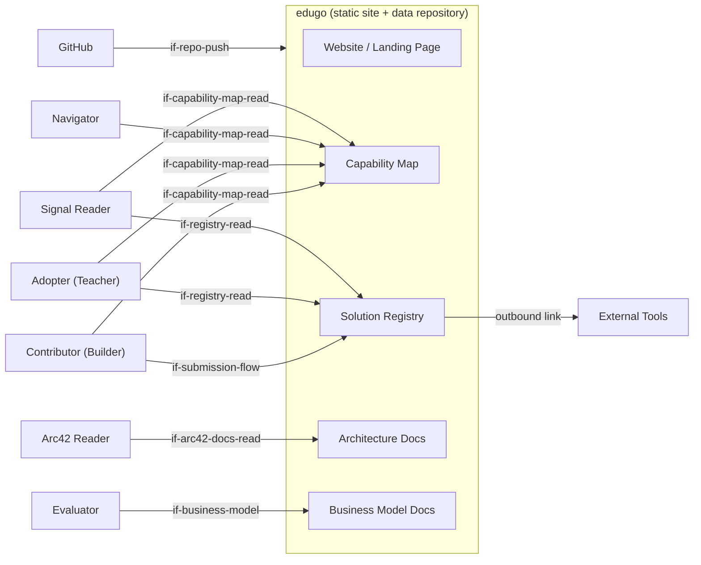

# System Scope and Context

<!--
Arc42 chapter 3. The system boundary and all external parties that interact with edugo.
-->

The edugo platform sits at the intersection of four groups: people who build educational tools,
people who adopt them in classrooms, GitHub as the persistence and contribution infrastructure,
and the broader web as the deployment surface. Everything inside the system boundary is a
static site rendered in the browser from files in the repository. There is no server component
in scope for Phase 1.

## Contributor (Builder)

A teacher, developer, or educator who submits a capability node or a registry entry. Interaction
is bidirectional: the contributor reads the capability map to find gaps worth filling, then
submits new entries via a GitHub Pull Request. The platform provides a structured submission
template (via PR template) and, in Phase 2, an AI-assisted web form.

```arc42
:::actor
id: actor-contributor
title: Contributor (Builder)
type: person
description: Submits capability nodes and registry entries; reads the gap view to find build opportunities
requires: if-site-nav, if-capability-map-read, if-registry-read, if-submission-flow
:::
```

## Adopter (Classroom Teacher)

A classroom teacher browsing the registry for tools that are safe, active-learning-focused, and
usable next week. Interaction is primarily read-only: browse, filter, assess trust signals, and
follow outbound links to the actual tools. The teacher does not submit entries but may signal
"I tried this" via GitHub reactions in Phase 2.

```arc42
:::actor
id: actor-adopter
title: Adopter (Classroom Teacher)
type: person
description: Browses registry for safe, active-learning tools; reads trust signals; follows outbound links to tools
requires: if-capability-map-read, if-registry-read
:::
```

## Navigator (School Coordinator)

A school principal or digital coordinator who wants an overview of what capability coverage looks
like and which tools are trusted. Interaction is read-only, focused on the capability map and
trust status of entries, not on individual tool details.

```arc42
:::actor
id: actor-navigator
title: Navigator (School Coordinator)
type: person
description: Reads capability coverage overview; assesses trust status of entries for school adoption decisions
requires: if-capability-map-read
:::
```

## Signal Reader (Researcher / Policy)

An education researcher or policy advisor who consumes the capability map and registry data
programmatically or via the UI to identify where innovation is happening and what gaps exist.
Requires machine-readable data in open formats, which the static data files satisfy directly.

```arc42
:::actor
id: actor-signal-reader
title: Signal Reader (Researcher / Policy)
type: person
description: Consumes capability map and registry data to track innovation trends and identify gaps
requires: if-capability-map-read, if-registry-read
:::
```

## Arc42 Reader (Open-Source Contributor / Platform Maintainer)

A developer building on or forking the platform, or a maintainer reviewing contributions, who
reads the architecture documentation to understand building block responsibilities, key decisions,
and contribution patterns. Interaction is read-only and technical: they consume the arc42 docs
to orient themselves before writing code or reviewing a PR.

```arc42
:::actor
id: actor-arc42-reader
title: Arc42 Reader (Contributor / Maintainer)
type: person
description: Reads architecture documentation to understand building block responsibilities, decisions, and contribution patterns
requires: if-docs-nav, if-arc42-docs-read
:::
```

## Evaluator (Partner / Funder / Institutional Adopter)

A foundation, public institution, or potential partner who wants to understand what edugo is,
what it aims to achieve, how it is organised, and how it is financed before deciding to engage.
Interaction is read-only and strategic: they consume the business model documentation (scope,
objectives, risks, products, cashflow) rather than the capability map or registry. The biz42
docs are their primary entry point.

```arc42
:::actor
id: actor-evaluator
title: Evaluator (Partner / Funder / Institution)
type: person
description: Assesses platform purpose, objectives, organisational structure, and financial model before deciding to engage or fund
requires: if-business-model
:::
```

## GitHub

GitHub acts as the sole backend: it hosts the repository, runs CI/CD via GitHub Actions, serves
the static site via GitHub Pages, and mediates all contributions through the Pull Request workflow.
edugo has no control over GitHub's availability or API changes. GitHub is also the contribution
identity layer — contributors are GitHub users.

```arc42
:::actor
id: actor-github
title: GitHub
type: system
description: Repository host, CI/CD runtime, static site host (GitHub Pages), and contribution workflow (Pull Requests)
requires: if-repo-push
:::
```

## External Educational Tools

Third-party tools and apps that are registered in the edugo registry. edugo links to them but
does not host, control, or proxy them. The connection is an outbound hyperlink; edugo has no
runtime dependency on these tools.

```arc42
:::actor
id: actor-external-tools
title: External Educational Tools
type: system
description: Third-party apps registered in the registry; linked but not hosted by edugo
requires: if-registry-read
:::
```

## Context Diagram

```arc42
:::diagram
id: ctx-diagram
view: context
notation: mermaid
aliases: actor_contributor=actor-contributor, actor_adopter=actor-adopter, actor_navigator=actor-navigator, actor_signal=actor-signal-reader, actor_arc42=actor-arc42-reader, actor_evaluator=actor-evaluator, actor_github=actor-github, actor_tools=actor-external-tools, bb_website=bb-website, bb_cap=bb-capability-map, bb_reg=bb-registry, bb_arc42=bb-arc42-docs, bb_biz42=bb-biz42-docs
:::
```


