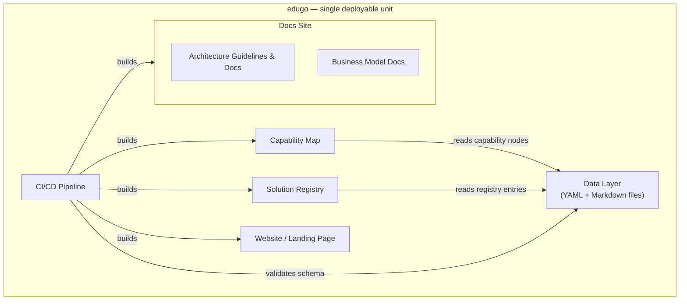

# Building Blocks

<!--
Arc42 chapter 5. The static decomposition of edugo into building blocks and their interfaces.
-->

edugo is a single deployable unit — a static site built from one repository. The building blocks
below are logical separations within that unit, not independently deployed services. They share
a build pipeline and a deployment target (GitHub Pages), but each has distinct responsibilities,
data sources, and rendering concerns.

```arc42
:::diagram
id: bb-diagram
view: building-block
notation: mermaid
aliases: bb_website=bb-website, bb_cap=bb-capability-map, bb_reg=bb-registry, bb_data=bb-data, bb_arc42=bb-arc42-docs, bb_biz42=bb-biz42-docs, bb_docs=bb-docs-site, bb_cicd=bb-cicd
:::
```



## Website / Landing Page

The primary narrative surface of edugo. Tells the story of the problem (PISA 2026, isolated
innovators, passive consumption), the vision (capability map + trusted ecosystem), and the
mechanism (cheap creation + quality layer). Phase 0 delivers this as a polished static page
with no functional registry or map. It must be compelling enough to generate genuine interest
before the platform infrastructure is built. It also serves as the persistent entry point for
all personas in Phase 1 and beyond.

Responsibility: story, calls to action, persona entry points, links to the capability map and registry.

```arc42
:::building-block
id: bb-website
title: Website / Landing Page
technology: Vue 3, Vite, UnoCSS
path: src
implements: concept-dsgvo-by-design
:::
```

### Interface: Build Configuration

Root-level Vite, UnoCSS, TypeScript, and npm configuration files that govern how the Vue app is assembled.

```arc42
:::interface
id: if-build-config
title: Build Configuration
provider: bb-website
protocol: Static files (Vite, UnoCSS, TypeScript config)
path: vite.config.ts
:::
```

### Interface: Root Project Configuration

The npm package manifest and lock file that pin all dependencies.

```arc42
:::interface
id: if-root-config
title: Root Project Configuration
provider: bb-website
protocol: npm package manifest and lock file
path: package.json
:::
```

### Interface: Website Navigation

The navigation interface consumed by all human actors to move between the site's sections
(landing page, capability map, registry, docs).

```arc42
:::interface
id: if-site-nav
title: Website Navigation
provider: bb-website
protocol: HTML / SPA routing (Vue Router)
path: src/main.ts
:::
```

## Capability Map

The strategic core of the platform. Renders the living map of educational capabilities from
structured data files. Shows each capability node with its coverage status (Needed / Partially /
Well covered), linked solutions, and gap signals. The gap view surfaces nodes with poor coverage
as build opportunities for contributors.

Responsibility: render capability nodes from data files; show coverage status; link to registry
entries; surface gap signals; provide a browsable and filterable view.

```arc42
:::ignore W018 bb-website, bb-capability-map, and bb-registry are co-located Vue components in a flat SPA under src/. Each has a more specific path than src/ to make implementation traceability meaningful, but paths naturally overlap. There is no parent building-block because edugo has no sub-module hierarchy — all three are peer components of the same application.
:::
```

```arc42
:::building-block
id: bb-capability-map
title: Capability Map
technology: Vue 3, Vite, UnoCSS
path: src/views/CapabilityMapView.vue
implements: concept-capability-map
requires: if-site-nav
:::
```

### Interface: Capability Map Read

The read interface provided to all actors who consume the capability map (contributors finding
gaps, adopters understanding what exists, navigators assessing school coverage, signal readers
tracking ecosystem health).

```arc42
:::interface
id: if-capability-map-read
title: Capability Map Read
provider: bb-capability-map
protocol: HTML (rendered static page + client-side filter)
path: src/composables/useCapabilityNodes.ts
:::
```

## Solution Registry

The tool catalog. Renders structured registry entries from YAML+Markdown data files. Supports
client-side filtering by capability node, DSGVO status, and capability links. Displays trust
signals (DSGVO badge). Links outbound to the actual tools.

Responsibility: render registry entries; compute and display trust signals; support client-side
filtering; provide the GitHub PR contribution entry point.

```arc42
:::ignore W018 same rationale as bb-capability-map: bb-registry is a peer Vue component in the flat SPA, its path overlaps with bb-website's src/ claim by design.
:::
```

```arc42
:::building-block
id: bb-registry
title: Solution Registry
technology: Vue 3, Vite, UnoCSS
path: src/views/RegistryView.vue
implements: concept-trust-signals, concept-composability
requires: if-site-nav
:::
```

### Interface: Registry Read

The read and filter interface consumed by adopters, contributors, and external tools linking
back to their registry entry.

```arc42
:::interface
id: if-registry-read
title: Registry Read
provider: bb-registry
protocol: HTML (rendered static page + client-side filter)
path: src/composables/useRegistryEntries.ts
:::
```

### Interface: Submission Flow

The contribution entry point: a pre-filled GitHub PR template opened from the registry UI.
In Phase 2 this becomes an AI-assisted web form that still terminates in a GitHub PR.

```arc42
:::interface
id: if-submission-flow
title: Submission Flow (GitHub PR)
provider: bb-registry
protocol: Deep-link to GitHub PR template (URL construction)
path: src/views/RegistryView.vue
:::
```

## Data Layer

The structured data that populates the capability map and solution registry. Not a deployable
component — a file system convention. All capability nodes live under `data/capabilities/` as
YAML-frontmatter Markdown files. All registry entries live under `data/entries/` in the same
format. JSON Schema files under `schemas/` define the required structure. A GitHub Action
validates every PR that touches `data/` against these schemas before merging.

Responsibility: persistent storage of all platform content; schema-validated structure;
human-editable in the GitHub web UI; open format for programmatic consumption.

The data layer has no named interface because it is consumed at build time via `import.meta.glob`
— not through a runtime API. The capability map and registry building blocks read from it during
the Vite build step, not at request time.

```arc42
:::ignore H004 bb-data has no named interface by design: it is consumed at Vite build time via import.meta.glob, not through a runtime API. The consumption is implicit in the build toolchain — there is no interface to model.
:::
```

```arc42
:::building-block
id: bb-data
title: Data Layer
technology: YAML frontmatter + Markdown, JSON Schema, GitHub Actions
path: data
implements: concept-data-formats, concept-schema-validation
:::
```

## Docs Site

The VitePress site that renders all documentation: architecture guidelines, contribution guides,
vision, and business model. It is a single static site built from `docs/` and deployed as a
subdirectory of the GitHub Pages artifact. Its two content areas — arc42 architecture docs and
biz42 business model docs — are modelled as child building blocks with distinct responsibilities
and audiences.

Responsibility: VitePress site configuration, shared layout, navigation, and non-specialised
pages (vision, contributing guidelines).

```arc42
:::building-block
id: bb-docs-site
title: Docs Site
technology: VitePress
path: docs
:::
```

### Interface: Docs Site Navigation

The top-level navigation consumed by all human actors browsing the docs site: arc42 reader,
evaluator, contributor, and maintainer.

```arc42
:::interface
id: if-docs-nav
title: Docs Site Navigation
provider: bb-docs-site
protocol: HTML (static VitePress pages)
path: docs
:::
```

### Architecture Guidelines & Docs

VitePress-rendered documentation covering the arc42 architecture (sourced from `docs/arc42/`),
contribution guidelines, builder patterns, and architecture decisions. This building block
is the vehicle for edugo's third platform job: providing architecture guidelines to app builders.
Arc42 CLI is used for authoring and validation of the architecture documents; VitePress renders
them alongside other documentation pages.

Responsibility: render architecture docs; publish builder patterns and contribution guidelines;
serve as the living record of platform decisions.

```arc42
:::building-block
id: bb-arc42-docs
title: Architecture Guidelines and Docs
technology: VitePress, arc42 CLI (authoring and validation)
path: docs/arc42
parent: bb-docs-site
implements: concept-vitepress-arc42
:::
```

#### Interface: Architecture Documentation Read

The read interface consumed by open-source contributors and platform maintainers who need to
understand building block responsibilities, key decisions, and contribution patterns.

```arc42
:::interface
id: if-arc42-docs-read
title: Architecture Documentation Read
provider: bb-arc42-docs
protocol: HTML (static VitePress pages)
path: docs/arc42
:::
```

### Business Model Docs

VitePress-rendered documentation covering the platform's scope, objectives, risks, products,
and financial model (sourced from `docs/biz42/`). This building block is the strategic entry
point for evaluators — partners, funders, and institutional adopters — who want to understand
what edugo is, what it aims to achieve, how it is organised, and how it is financed before
deciding to engage. Authored using the biz42 DSL and validated with the biz42 CLI.

Responsibility: publish the platform's business model in a readable, navigable form; serve as
the authoritative record of organisational scope, objectives, and financial model.

```arc42
:::building-block
id: bb-biz42-docs
title: Business Model Docs
technology: VitePress, biz42 CLI (authoring and validation)
path: docs/biz42
parent: bb-docs-site
:::
```

#### Interface: Business Model Documentation Read

The strategic read interface consumed by evaluators who want to understand the platform's
purpose, organisation, and financial model.

```arc42
:::interface
id: if-business-model
title: Business Model Documentation Read
provider: bb-biz42-docs
protocol: HTML (static VitePress pages)
path: docs/biz42
:::
```

## CI/CD Pipeline

The GitHub Actions workflows that validate, build, and deploy the platform on every push to
`main`. Not a user-facing building block but architecturally significant because it is the only
"server" in the system — the automated layer that enforces schema validity and produces the
deployable artifact.

Responsibility: schema validation on PRs; build on merge to `main`; deploy to GitHub Pages.

```arc42
:::building-block
id: bb-cicd
title: CI/CD Pipeline
technology: GitHub Actions, Vite, arc42 CLI
path: .github/workflows
:::
```

### Interface: Repository Push

The interface consumed by GitHub (the external actor) to trigger CI/CD. When GitHub pushes to
`main` (or opens a PR), workflows are triggered.

```arc42
:::interface
id: if-repo-push
title: Repository Push / PR Event
provider: bb-cicd
protocol: GitHub Actions event (push, pull_request)
path: .github/workflows/deploy.yml
:::
```
