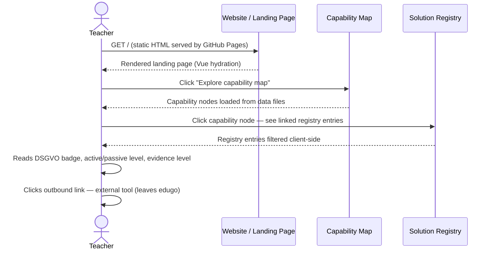
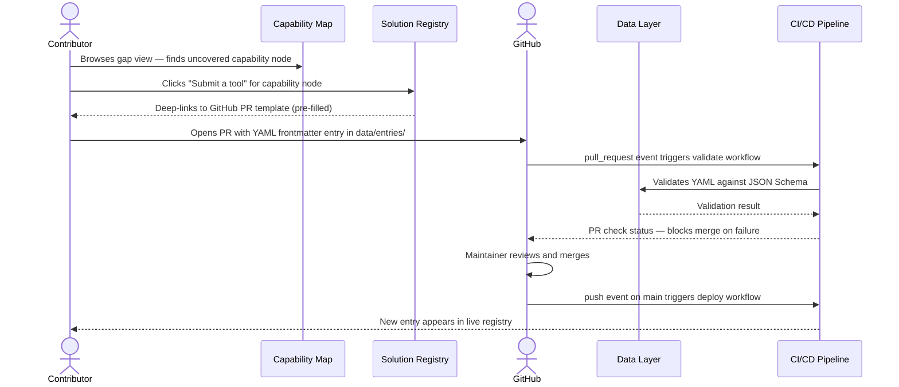
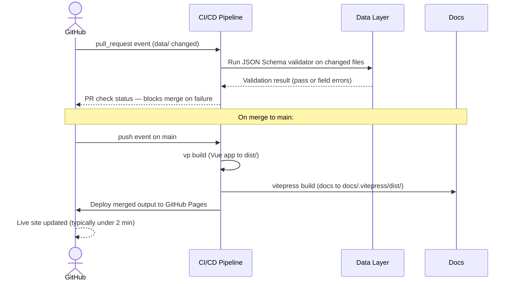

# Runtime View

<!--
Arc42 chapter 6. Representative runtime scenarios for edugo.
-->

Three scenarios cover the architecturally significant flows: a teacher finding and assessing a
tool, a contributor submitting a new entry, and the CI/CD pipeline validating and deploying a
merged PR.

## Scenario 1: Teacher Discovers a Tool

A classroom teacher arrives at edugo, filters the registry for tools that are active-learning
focused and DSGVO-green for primary school maths, and follows a link to an external tool. The
entire flow is static-page rendering and client-side JavaScript — no server call is made after
the initial page load.

```arc42
:::runtime-scenario
id: rs-teacher-discovery
title: Teacher discovers a tool via the registry
trigger: Teacher opens edugo from a link shared in Bildungstwitter
involves: bb-website, bb-capability-map, bb-registry
:::
```

```arc42
:::diagram
id: seq-teacher-discovery
notation: mermaid-sequence
scenario: rs-teacher-discovery
aliases: bb_website=bb-website, bb_cap=bb-capability-map, bb_reg=bb-registry
:::
```



## Scenario 2: Contributor Submits an Entry

A developer has built a Vue-based interactive grammar trainer. They open edugo, find the
relevant capability gap in the map, click "Submit a tool", and are taken to a pre-filled
GitHub PR template. They complete the YAML frontmatter fields (or use the AI-assisted form
in Phase 2), open the PR, and a maintainer reviews and merges it. The CI/CD pipeline then
redeploys the site with the new entry.

```arc42
:::runtime-scenario
id: rs-contributor-submission
title: Contributor submits a new registry entry via GitHub PR
trigger: Contributor finds a gap in the capability map and wants to register their tool
involves: bb-capability-map, bb-registry, bb-data, bb-cicd
:::
```

```arc42
:::diagram
id: seq-contributor-submission
notation: mermaid-sequence
scenario: rs-contributor-submission
aliases: bb_cap=bb-capability-map, bb_reg=bb-registry, bb_data=bb-data, bb_cicd=bb-cicd
:::
```



## Scenario 3: CI/CD Validation and Deployment

Every PR that touches `data/` triggers schema validation. Every merge to `main` triggers a
full build and deploy. This is the only "server-side" logic in the system — and it runs
entirely within GitHub's infrastructure, not on any edugo-owned server.

```arc42
:::runtime-scenario
id: rs-cicd-deploy
title: CI/CD validates PR and deploys on merge to main
trigger: PR opened or pushed to; or merge to main branch
involves: bb-data, bb-cicd, bb-docs
:::
```

```arc42
:::diagram
id: seq-cicd-deploy
notation: mermaid-sequence
scenario: rs-cicd-deploy
aliases: bb_data=bb-data, bb_cicd=bb-cicd, bb_docs=bb-docs
:::
```


