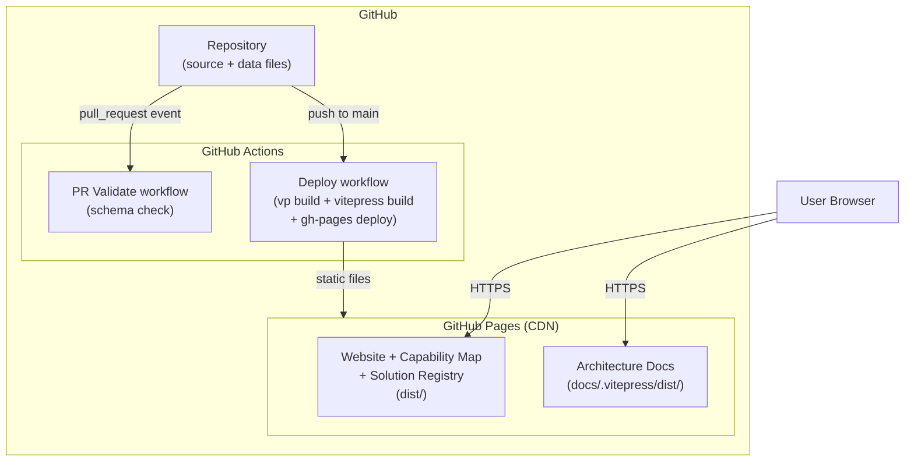

# Deployment View

<!--
Arc42 chapter 7. The infrastructure and deployment mapping for edugo.
-->

The deployment topology is intentionally minimal. There is one environment (production) and one
infrastructure provider (GitHub). The entire platform is static files served by GitHub Pages.
There is no separate staging environment in Phase 1 — PRs include a GitHub Actions preview deploy
as the testing surface.

## GitHub (Infrastructure Provider)

GitHub provides the full infrastructure stack: repository hosting, CI/CD execution (GitHub
Actions), static site serving (GitHub Pages), and contribution workflow (Pull Requests).

```arc42
:::deployment-node
id: dn-github
title: GitHub
type: cloud-region
:::
```

## GitHub Pages (CDN / Static Host)

GitHub Pages serves the built static assets globally via CDN. It hosts the merged output of
the Vue app build (`dist/`) and the VitePress docs build (`docs/.vitepress/dist/`). No server-side
rendering, no API proxy, no runtime environment.

```arc42
:::deployment-node
id: dn-github-pages
title: GitHub Pages (Static Host / CDN)
type: server
parent: dn-github
hosts: bb-website, bb-capability-map, bb-registry, bb-docs
:::
```

## GitHub Actions (CI/CD Runner)

GitHub Actions provides the compute environment for validation, building, and deployment. Two
workflow types:
- **PR workflow**: triggered on pull_request events; runs schema validation against `data/`
- **Deploy workflow**: triggered on push to `main`; runs `vp build`, VitePress build, and
  deploys merged output to GitHub Pages

```arc42
:::deployment-node
id: dn-github-actions
title: GitHub Actions (CI/CD Runner)
type: container
parent: dn-github
hosts: bb-cicd, bb-data
:::
```

## Browser (User Agent)

The user's browser is the runtime for all application logic. Vue 3 renders and hydrates the
application client-side. UnoCSS styles are bundled. There is no server-side session, no
authentication, no cookies (beyond SPA navigation state).

```arc42
:::deployment-node
id: dn-browser
title: User Browser
type: device
hosts: bb-website, bb-capability-map, bb-registry
:::
```

## Deployment Diagram

```arc42
:::diagram
id: dep-diagram
notation: mermaid
:::
```



## Build Output Structure

The Vue SPA owns the deploy root. VitePress docs and arc42 architecture docs are
placed in subdirectories to avoid base-path conflicts. This layout was adopted in
Phase 1 to allow GitHub Pages to serve the SPA at the canonical `/edugo/` URL
without a redirect layer (see ADR-08).

```
dist/                        # deploy root (uploaded as GitHub Pages artifact)
├── index.html               # Vue SPA entry (landing page at /#/)
├── assets/                  # Vue app JS/CSS bundle (Vite build output)
├── docs/                    # VitePress docs site (built to docs/dist/, copied here)
│   ├── index.html
│   ├── vision.html
│   └── contributing.html
├── architecture/            # arc42 docs (arc42 build --out dist/architecture)
│   └── index.html
└── schemas/                 # Published JSON Schemas for editor/CI consumption
    ├── capability-node.json
    └── registry-entry.json
```

The Vue app is configured with `base: '/edugo/'` (Vite config). VitePress uses
`base: '/edugo/docs/'`. arc42 CLI builds with `--base /edugo/architecture/`.
